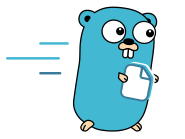

<p align="center">
  
</p>

# Filegate

Filegate is a Linux file gateway for applications that need REST, typed SDK,
and optional path-style S3 access to normal filesystem storage.

Files remain ordinary files on configured mounts. Stable IDs live in the
`user.filegate.id` xattr, while a rebuildable Pebble index accelerates listings,
path lookup, uploads, and metadata reads.

## Capabilities

- REST API with stable path and node-ID addressing
- resumable and direct browser uploads
- streaming file and directory downloads
- TypeScript and Go clients
- optional path-style S3 listener with scoped access keys
- per-file version history with probed reflink or byte-copy behavior
- polling or btrfs-based external-change detection
- separate operator Admin app

## Production boundaries

- Linux-only, single-node, and single-tenant
- one full-authority REST bearer token; narrower scopes exist only for S3 keys
- exactly one daemon per runtime store, index, and writable mount set
- TLS and REST rate limiting belong at the reverse proxy or private network
- user xattrs are required and must be preserved by backup tooling

Read the [Security model](https://filegate.dev/docs/en/security) and
[Operations guide](https://filegate.dev/docs/en/operations) before deploying.

## Install

Install a release package and run Filegate through systemd. Replace `amd64`
with `arm64` on ARM hosts.

```sh
curl -fL -o /tmp/filegate.deb \
  https://github.com/valentinkolb/filegate/releases/latest/download/filegate_linux_amd64.deb
sudo dpkg -i /tmp/filegate.deb
sudo systemctl enable --now filegate
```

The first start generates and prints a REST token when none is configured. The
token and applied runtime configuration are persisted under
`/var/lib/filegate/config`.

Verify liveness, then follow the authenticated readiness procedure in the
installation guide:

```sh
curl -fsS http://127.0.0.1:8080/health
```

## Documentation

The canonical documentation is the Fibel site at
[filegate.dev/docs](https://filegate.dev/docs/en/).

- [Getting started](https://filegate.dev/docs/en/getting-started)
- [Installation](https://filegate.dev/docs/en/installation)
- [Configuration](https://filegate.dev/docs/en/configuration)
- [HTTP API](https://filegate.dev/docs/en/http-api)
- [TypeScript SDK](https://filegate.dev/docs/en/ts-sdk)
- [Go SDK](https://filegate.dev/docs/en/go-sdk)
- [S3 compatibility](https://filegate.dev/docs/en/s3)
- [Admin UI](https://filegate.dev/docs/en/admin)
- [Reference](https://filegate.dev/docs/en/reference/http-routes)
- [Development architecture](https://filegate.dev/docs/en/development/architecture)

The site also exposes searchable pages, raw Markdown, and `llms.txt`. Its source
lives in [`docs-site/docs/en`](docs-site/docs/en).

## Development

```sh
go test ./...
go vet ./...
staticcheck ./...
```

Run the documentation site:

```sh
cd docs-site
bun install --frozen-lockfile
bun run typecheck
bun run dev
```

## Agent skills

```sh
bunx skills add ValentinKolb/filegate
```

- Integration skill: [`skills/filegate/SKILL.md`](skills/filegate/SKILL.md)
- Contributor skill: [`skills/filegate-dev/SKILL.md`](skills/filegate-dev/SKILL.md)
